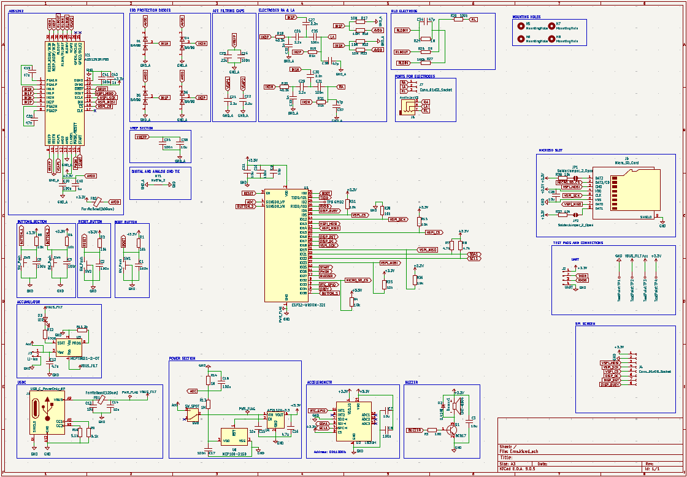

## Piny ESP32:
 - GPIO0: do boot; najlepiej podciągnąć do 3.3V przez rezystor 10Kom i dodać przycisk, który ściąga do GND;
 - GPIO2: podczas wchodzenia w tryb programowania, pin musi być w stanie niskim lub niepodłączonym; póżniej już nie ma znaczenia jaki ma stan;
  - GPIO5: ma wewnętrzny pull-up, nie ma znaczenia, gdy gpio0 i gpio2 są poprawnie ustawione, unikać urządzeń które przy starcie wymuszają stan niski;
 - GPIO6-GPIO11 są do pamięci flash;
 - GPIO12:jeśli trzeba użyć jako gpio(bo wszystkie inne zajęte) to trzeba się upewnić, że przy starcie nie wymuszany jest stan wysoki;
 - GPIO15: ma wewnątrz pull-up więc domyślnie jest na 3.3V, można używać jako GPIO; on odpowiada za to, że w trminalu jest boot:0x13 (SPI_FAST_FLASH_BOOT),
gdy przy włączaniu esp32, będzie na stan 0 to esp32 będzie milczeć podczas startu, na schemacie w dokumentacji nie widać rezystora podciągającego, 
co oznacza że wewnątrz krzemu jest podciągnięcie i one jest bardzo słabe. jak się chce być w 100% pewnym to można podciągnąć go zewnętrznie do 3.3V;
 - Na pin VDD można podpiąć napięcie od 3.0V do 3.6V.

## PINY DO PERYFERIÓW:
 - CZYTNIK KARTY SD: MISO -> GPIO19, MOSI -> GPIO23, SS/CS -> GPIO32, SCK -> GPIO18;
 - MODUŁ EKG: START -> GPIO25, PWDN -> GPIO26, HSPI_CS -> GPIO15, HSPI_MOSI -> GPIO13, HSPI_SCK -> GPIO12, HSPI_MISO -> GPIO14;
 - WYŚWIETLACZ: Busy_pin -> GPIO4, CS_pin -> GPIO5, DC_Pin -> GPIO17, RST_Pin -> GPIO16, SCK_Pin -> GPIO18 , MOSI_pin -> GPIO23;
 - PRZYCISKI: piny GPIO5, GPIO37;
 - AKCELEROMETR: I2C GPIO21 i GPIO22. 

## Schemat PCB

